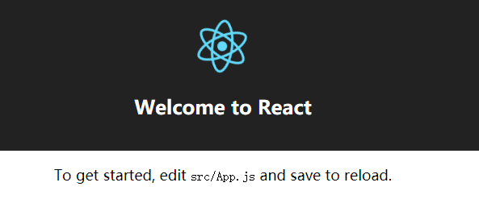
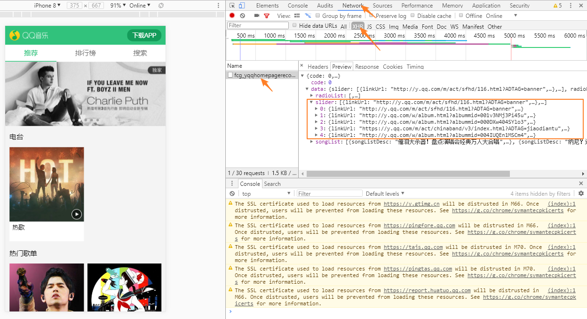
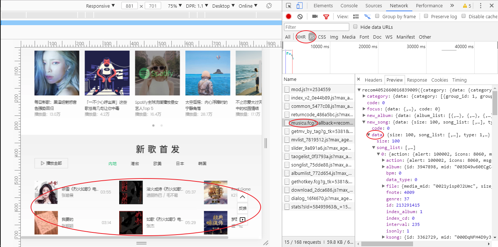
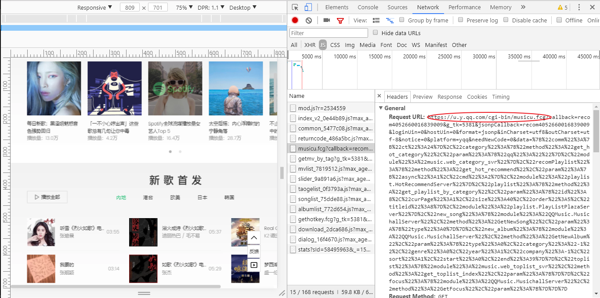
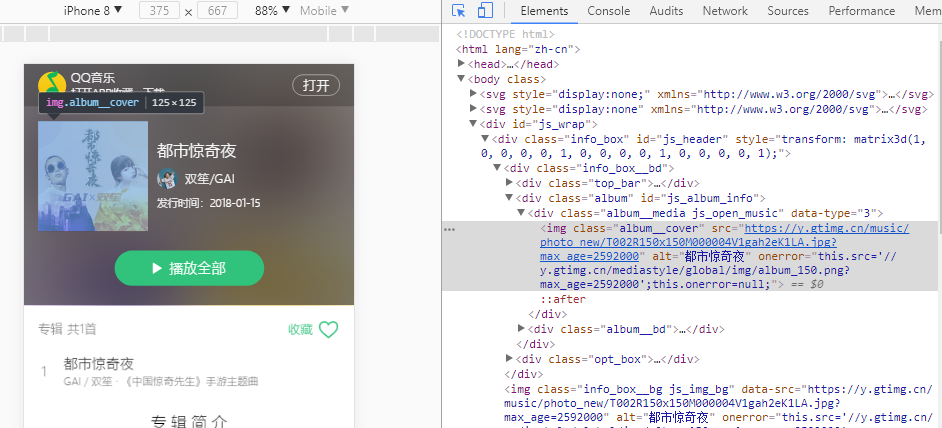
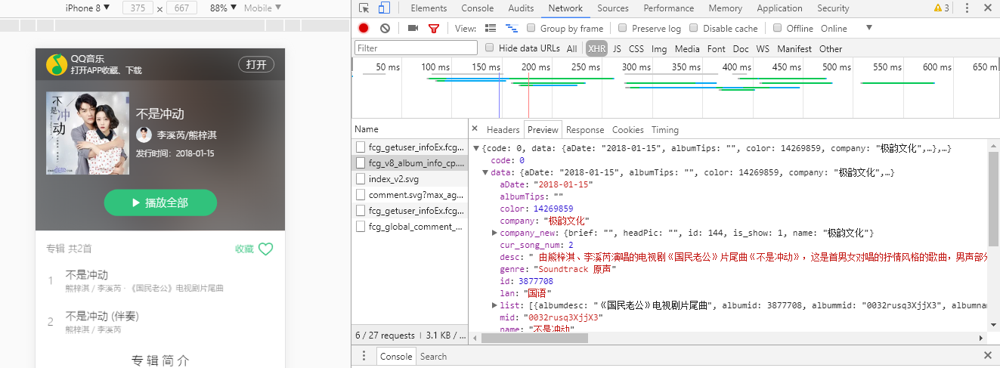

# Songtaste

### 技术栈
React + React-router + Redux + create-react-app + Webpack + Stylus + ES6/7

### 项目运行
``` bash
# git克隆
git clone https://github.com/Beth-Chan/songtaste.git

# 安装依赖
npm install

# 会自动打开浏览器，运行服务器，地址为localhost:3000
npm start
```

F12打开调试模式可以看到手机上的效果

### 项目描述
``` bash
npm install -g create-react-app
create-react-app songtaste
cd songtaste
npm start
```

create-react-app：Facebook官方脚手架，是一个全局的命令行工具，用来创建一个新的项目。默认搭建基于webpack的React开发环境，内置了热更新等功能，只需要专心写src源代码就可以了（默认node_modules文件夹下有react-scripts文件夹，npm run eject命令会把潜藏在react-scripts中的一系列技术栈配置都“弹射”到应用的顶层，后面用Stylus时再“弹射”出Webpack，并在Webpack加上相关配置）。

react-scripts有以下支持：
>React, JSX, ES6, and Flow syntax support.
Language extras beyond ES6 like the object spread operator.
Import CSS and image files directly from JavaScript.
Autoprefixed CSS, so you don’t need -webkit or other prefixes.
A build script to bundle JS, CSS, and images for production, with sourcemaps.
A dev server that lints for common errors.  

也就是说，babel-core，webpack等都不用下载配置，react-scripts 都配置好了。

然后浏览器自动跳出React启动页，网址为http://localhost:3000/


看下文件目录：
（1）<strong>index.html</strong>：
public/index.html 是启动http服务器的首页
index.html文件包含挂载点：
```
<div id="root"></div>
```
（2）<strong>App.js</strong>：在src下创建一个components文件夹，把App.js和app.css移到此文件夹下（App.js是主组件）

（3）<strong>index.js</strong>：src/index.js是编译的入口文件
注：只能叫index这个名字，改别的名字不行，要改得改webpack配置
index.js文件主要是下面这句：
``` jsx
ReactDOM.render(<App />, document.getElementById('root'));
```

在网站首页右键查看网页源代码，或f12->Source->(index)查看网页源代码，看到 
\<script type="text/javascript" src="/static/js/bundle.js">\</script>  
/static/js/bundle.js这个文件路径，在项目里是看不到的，我们也没有写配置文件webpack.config.js,http服务器配置，自动代开浏览器窗口，jsx，es6语法编译，babel-core，webpack等都没下载配置。但这些react-scripts 都配置了。


接下来，在git bash里敲入Ctrl+C（react app还是有运行），安装stylus、stylus-loader
```bash
npm i stylus stylus-loader -SD
```

要用stylus，得执行npm run eject命令暴露出create-react-app的webpack（不可逆操作），
在生成的config文件夹修改webpack.config.dev.js，在file-loader前添加上stylus语法解析:

    {
        test: /\.styl$/,
        use: [
            require.resolve('style-loader'),
            require.resolve('css-loader'),
            require.resolve('stylus-loader')
        ]
    }


将项目下的App.css修改成app.styl，去掉里面的花括号和分号（用Ctrl+H替换，将;分号替换为空，将{左花括号替换为空，将}右花括号替换为空）
<br>

##### 字体图标制作

为什么要使用字体图标？
	1. 图标放大或缩小不会被拉伸，会保持足够的清晰度
	2. 颜色可以随意设置。如果使用普通图片，图片颜色已经是设计好的，如果要换颜色需要借助工具来对图片进行修改

开始制作字体图标：
制作字体图片首先我们需要svg图片。svg图片可以从<a href="http://www.iconfont.cn">iconfont阿里矢量图标库</a>自行选择。笔者已经下载了项目需要的svg图片
借助一个叫<em>iconmoon</em>的网站。浏览器地址上输入：icomoon.io/app
点击上方的Import Icons按钮，选择刚刚下载的svg图片；然后选中所有的图标，点击Generate Font；跳转界面，可设置名字，可以改成icomusic；点击download；下载后是压缩包。
该压缩包包含了字体图标使用的demo，和生成的字体图标文件及相关样式。

应用到项目里：
在项目src目录下面新建一个assets目录然后再新建一个stylus目录用来放置styl文件，解压压缩包把里面的style.css和fonts文件夹复制出来放置到stylus目录下。

对style.css稍做修改：
将style.css重命名为font.styl。然后打开icomusic将里面的花括号和分号去掉变成标准的styl语法格式
<br>

##### 其他

加上reset.styl

三个Tab对应三个路由，采用flex布局，自适应屏幕宽度
<br>

##### 数据抓取

用chrome浏览器打开手机调试模式，打开QQ音乐移动端地址：m.y.qq.com。打开后点击Network，然后点击XHR，可以看到有一个ajax请求。点开后，选择preview，红色框内就是我们最后需要的轮播数据


复制出来是这样：
https://c.y.qq.com/musichall/fcgi-bin/fcg_yqqhomepagerecommend.fcg?g_tk=5381&uin=0&format=json&inCharset=utf-8&outCharset=utf-8&notice=0&platform=h5&needNewCode=1&_=1515738030186
只取问号前面的部分：
https://c.y.qq.com/musichall/fcgi-bin/fcg_yqqhomepagerecommend.fcg

点击Chrome调试界面左上角的第二个图标切换到桌面版（或在Chrome浏览器调试界面显示区的右上角选择add device type，然后把mobile切换成桌面版刷新），因为最新专辑只有桌面版才有

切换到Header头部：

<br>

##### JSONP与Promise
ES6提供了Promise对象，它可以将异步代码以同步的形式编写

这里接口用的是ajax请求，用这种方式存在跨域限制，前端是不能直接请求的，QQ音乐人性化的基本上大部分接口都支持jsonp请求。为了使用jsonp，这里使用一款<b>jsonp</b>插件，首先安装jsonp依赖
   
    npm install jsonp --save

插件github地址：https://github.com/webmodules/jsonp
#### JSONP原理
动态生成一个\<script\>标签，其src由**接口url**、**请求参数**、**callback函数名**拼接而成，利用\<script\>标签没有跨域限制的特性实现跨域请求。

```
import originJsonp from "jsonp";

/* 使用ES6的Promise对象将jsonp代码封装成同步代码形式，这个函数返回一个Promise对象 */
let jsonp = (url, data, option) => {
    // 在Promise构造函数内调用jsonp，请求成功时调用resolve函数把data的值传出去，请求错误时调用reject函数把err的值传出去。
    return new Promise((resolve, reject) => {
        originJsonp(buildUrl(url, data), option, (err, data) => {
            if (!err) {
                resolve(data);
            } else {
                reject(err);
            }
        });
    });
};

// 所有的query param通过data加到url后，最后变成xxxx?参数名1=参数值1&参数名2=参数值2这种形式.
function buildUrl(url,data) {
    let params = [];
    for (var k in data) { // 把data遍历放进params数组
        params.push(`${k}=${encodeURIComponent(data[k])}`); // ES6语法
    }
    let param = params.join("&"); // 把数组中的所有元素放入param字符串。
    if (url.indexOf("?") === -1) { // 没有问号在后面加?和转化后的param字符串
        url += "?" + param;
    } else { // 有问号就会有查询字符串，直接在后面加&和转化后的param字符串
        url += "&" + param;
    }
    return url;
}

export default jsonp;
```

#### API
为了养成好的编程习惯呢，通常会把接口请求代码存放到api目录下面，很多人会把接口的url一同写在请求的代码中，这里呢，我们把url抽取出来放到单独的一个文件里面便于管理。

api文件夹下的Recommend.js和song.js多次使用Object.assign()方法.
Object.assign() 方法是用于将所有可枚举属性的值从一个或多个源对象复制到目标对象。它将返回目标对象。
Object.assign(target, ...sources)
target目标对象。
sources源对象。

Recommend.js中：
```
/**
 * Object.assign方法合并对象，将接口的公共参数和轮播图特有的参数合并，相同的属性值会被覆盖
 * 轮播图的url是：https://c.y.qq.com/musichall/fcgi-bin/fcg_yqqhomepagerecommend.fcg?g_tk=5381&uin=0&format=json&inCharset=utf-8&outCharset=utf-8&notice=0&platform=h5&needNewCode=1&_=1515763697741
 */
export function getCarousel() {
    const data = Object.assign({}, PARAM, {
        g_tk: 701075963,
		uin: 0,
		platform: "h5",
		needNewCode: 1,
		_: new Date().getTime()
    });
    return jsonp(URL.carousel, data, OPTION);
}

export function getNewAlbum() {
	const data = Object.assign({}, PARAM, {
		g_tk: 1278911659,
		hostUin: 0,
		platform: "yqq",
		needNewCode: 0,
		data: `{"albumlib":
		{"method":"get_album_by_tags","param":
		{"area":1,"company":-1,"genre":-1,"type":-1,"year":-1,"sort":2,"get_tags":1,"sin":0,"num":50,"click_albumid":0},
		"module":"music.web_album_library"}}`
	});
	const option = {
		param: "callback",
		prefix: "callback"
	};
	return jsonp(URL.newalbum, data, option);
}

/**
 * 获取专辑请求
 * @param {string} albumMid 请求地址的albumMid参数
 */
export function getAlbumInfo(albumMid) {
	const data = Object.assign({}, PARAM, {
		albummid: albumMid,
		g_tk: 1278911659,
		hostUin: 0,
		platform: "yqq",
		needNewCode: 0
	});
	return jsonp(URL.albumInfo, data, OPTION);
}
```


发送接口请求在<b>componentDidMount</b>这个生命周期函数中，因为应该在**组件挂载完成后进行请求**，防止异部操作阻塞UI。
关于React的一些生命周期函数：
一般的，我们会在<b>componentDidMount</b>**函数中获取DOM，对DOM进行操作**。React每次更新都会调用render函数，使用<b>shouldComponentUpdate</b>可以帮助我们控制组件是否更新，返回true组件会更新，返回false就会阻止更新，这也是**性能优化**的一种手段。<b>componentWillUnmount</b>通常用来销毁一些资源，比如**setInterval、setTimeout**函数调用后可以在该周期函数内进行资源释放。


##### swiper
页面轮播使用swiper插件实现，swiper更多用法见官网：www.swiper.com.cn

##### 图片懒加载
当用户滚动列表，图片显示出来时才加载
react-lazyload库其实是组件的懒加载，用它来实现图片懒加载

##### 取得专辑封面图片地址



##### 专辑详情相关数据



#### Redux

Redux用于**状态管理**，用一个单独的常量状态树（对象）来管理保存整个应用的状态，这个对象不能直接被修改。

在我们的应用中有很多歌曲列表页，点击列表页的歌曲就会播放点击的歌曲，同时列表页还有播放全部按钮，点击后当前列表的所有歌曲会添加到播放列表中，每一个歌曲列表都是一个组件，相互独立，没有任何关系。歌曲播放组件需要播放的歌曲，歌曲列表还有一个是否显示播放页属性，它们统一使用redux来管理.

为了达到背景播放的目的，将歌曲播放组件放置到App组件内路由相关组件外，也就是每个列表页组件最外层的组件，当App组件挂载后，播放组件会一直存在整个应用中不会被销毁（除退出应用程序之外）。

react-redux库包含了容器组件和展示组件相分离的开发思想，在最顶层组件使用redux，其余内部组件仅仅用来展示，所有数据通过props传入

| 说明        | 容器组件    |  展示组件  |
| --------   | -----:   | :----: |
| 读取数据  | 从 Redux 获取 state  | 从 props 获取数据    |
| 修改数据        | 向 Redux 派发 actions      |   从 props 调用回调函数    |


react-redux提供了**Provider**组件和**connect**方法帮助Redux和React进行绑定。
Provider接收一个store作为props，用来**传递store**，它是整个Redux应用的顶层组件；
connect提供了在整个React应用的**任意组件中获取store中数据**的功能，用来将组件连接到redux，任何一个从 connect() 包装好的组件都可以得到一个 dispatch 方法作为组件的 props，以及得到全局 state 中所需的任何内容

